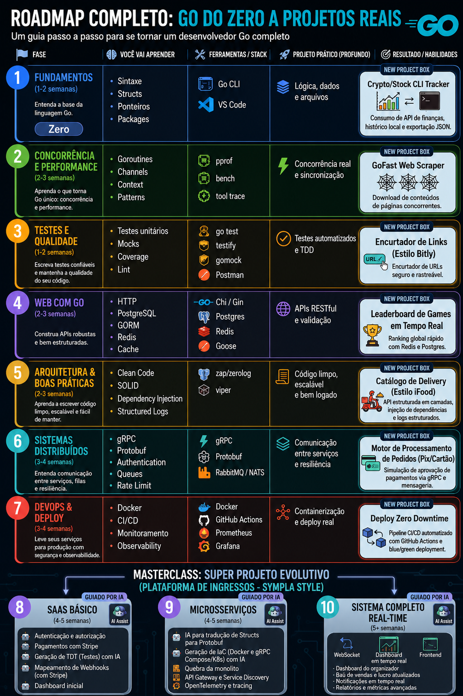

# 🚀 Roadmap Completo de Go — Do Zero a Projetos Reais

Um roadmap completo para aprender Golang na prática, saindo do básico até projetos reais com:

* APIs REST
* Concorrência
* Arquitetura profissional
* Microserviços
* DevOps
* Observabilidade
* Deploy em produção

---

# 🖼️ Roadmap



---

# 🎯 Objetivo

Esse roadmap foi criado para ajudar desenvolvedores a:

* aprender Go da forma certa
* sair do tutorial hell
* construir projetos reais
* criar portfólio forte
* evoluir para backend moderno
* entender arquitetura profissional
* trabalhar com sistemas escaláveis

---

# 📚 Etapas do Roadmap

## 1. Fundamentos

Aprenda:

* sintaxe
* structs
* ponteiros
* packages

Projeto:

* Crypto/Stock CLI Tracker

---

## 2. Concorrência e Performance

Aprenda:

* goroutines
* channels
* context
* concurrency patterns

Projeto:

* GoFast Web Scraper

---

## 3. Testes e Qualidade

Aprenda:

* testes unitários
* mocks
* coverage
* lint

Projeto:

* Encurtador de Links (Bitly Style)

---

## 4. Web com Go

Aprenda:

* APIs REST
* PostgreSQL
* GORM
* Redis
* cache

Projeto:

* Leaderboard em Tempo Real

---

## 5. Arquitetura e Boas Práticas

Aprenda:

* Clean Code
* SOLID
* Dependency Injection
* Structured Logs

Projeto:

* Catálogo de Delivery (iFood Style)

---

## 6. Sistemas Distribuídos

Aprenda:

* gRPC
* protobuf
* mensageria
* filas
* rate limit

Projeto:

* Motor de Processamento de Pedidos

---

## 7. DevOps e Deploy

Aprenda:

* Docker
* CI/CD
* Observabilidade
* Prometheus
* Grafana

Projeto:

* Deploy Zero Downtime

---

# 🔥 Masterclass — Projeto Evolutivo

## Plataforma de Ingressos (Sympla Style)

Projeto principal dividido em 3 grandes etapas:

---

## 8. SaaS Básico

* autenticação
* Stripe
* webhooks
* geração de testes
* integração IA

---

## 9. Microserviços

* API Gateway
* Service Discovery
* OpenTelemetry
* protobuf
* Docker/Kubernetes

---

## 10. Sistema Completo Real-Time

* WebSockets
* dashboards em tempo real
* métricas
* observabilidade
* frontend integrado

---

# 🛠️ Stack Recomendada

## Backend

* Go
* Gin/Chi
* gRPC
* RabbitMQ/NATS

## Banco

* PostgreSQL
* Redis

## Infraestrutura

* Docker
* Kubernetes
* GitHub Actions

## Observabilidade

* Prometheus
* Grafana
* OpenTelemetry

---

# 📺 Canal no YouTube

Conteúdo sobre:

* Go
* backend
* arquitetura
* IA
* projetos reais
* sistemas distribuídos

👉 Acompanhe a evolução dos projetos no canal.

https://www.youtube.com/@EichstaedtRafael

---

# ⭐ Filosofia do Roadmap

```txt
30% teoria
70% construção real
```

A melhor forma de aprender Go é:

* construindo
* quebrando
* refatorando
* deployando
* escalando sistemas reais

---

# 🚀 Próximos passos

* criar os projetos do roadmap
* documentar evolução
* subir tudo no GitHub
* transformar em portfólio real
* produzir conteúdo técnico sobre a jornada

---

# 📌 Licença

Livre para estudos e uso pessoal.
